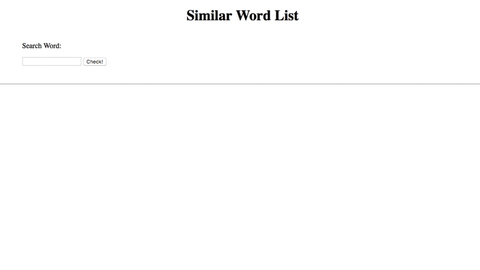

# Similar words sorted by frequency (Front-End)

You input the search word and click the check button, so synonyms and word appearance frequencies of a site display.

## Getting Started

### Demo

the output is displayed as the result like the image below.



### Prerequisites

> A Vue.js project

* [API](https://github.com/atsushieee/similar-word-dict)

### Installing

``` bash
# install dependencies
npm install
```

## Running the tests

### modify a line written API URL in 'src/main.js'

```
axios.defaults.baseURL = 'localhost:5000'
```

### npm run

``` bash
# serve with hot reload at localhost:8080
npm run dev

# build for production with minification
npm run build
```

## Deployment

deploy for AWS S3.

### howto

1. [Create bucket](https://docs.aws.amazon.com/AmazonS3/latest/gsg/CreatingABucket.html)
1. [Valid Static website hosting](https://docs.aws.amazon.com/AmazonS3/latest/dev/EnableWebsiteHosting.html)
1. [Set bucket policy](https://docs.aws.amazon.com/AmazonS3/latest/dev/example-bucket-policies.html)
1. [Upload Files](https://docs.aws.amazon.com/redshift/latest/dg/tutorial-loading-data-upload-files.html)

## Authors

* **Atsushi Tabata**  [Private URL](https://ippoippo.info)

## License

This project is licensed under the MIT License - see the [LICENSE.txt](LICENSE.txt) file for details
